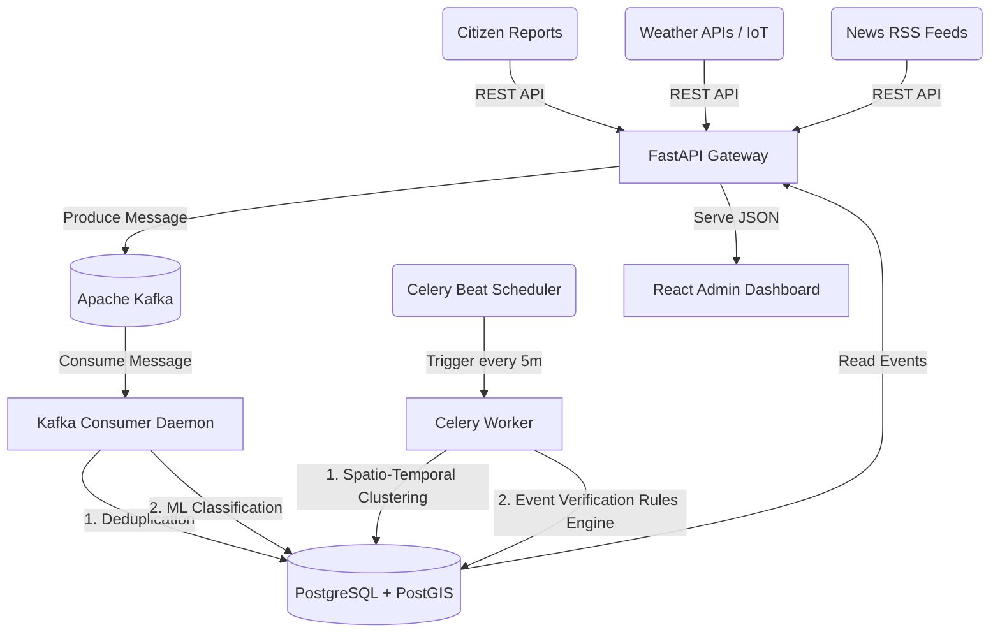

# National Weather Big Data Analytics Platform

A highly scalable, real-time weather event verification and intelligence platform built for the India Meteorological Department (IMD) / Ministry of Earth Sciences.

This platform ingests raw weather reports from multiple sources (citizens, IoT APIs, RSS feeds), automatically detects and merges duplicate reports, classifies them using Machine Learning (NLP), groups them into high-level "Events," and assigns dynamic trust scores.

## Architecture

The system is built on a modern event-driven architecture using Docker, FastAPI, React, PostgreSQL (with PostGIS), Redis, Celery, and Apache Kafka.



## Core Features

1. **Intelligent Deduplication**: Prevents database bloat by dynamically calculating geographic Haversine distance (<5km) and Python string similarity (>70%) to merge redundant citizen reports in memory.
2. **Machine Learning Classification**: A custom NLP Pipeline (`scikit-learn` TF-IDF + Logistic Regression) that classifies raw unstructured text into 8 weather categories.
3. **Automated Event Clustering**: Background Celery workers continuously scan the database to group isolated reports into overarching spatio-temporal "Events" (e.g., "Mumbai Floods").
4. **Dynamic Trust Verification**: A rules engine that instantly upgrades an Event to `VERIFIED` if it receives 1 official report or 3 independent citizen corroborations.
5. **Streaming Ingestion**: Apache Kafka decoupled ingestion ensures the platform can handle millions of reports during extreme weather events without crashing the PostgreSQL database.
6. **Command Center Dashboard**: A sleek, dark-mode React UI featuring interactive Leaflet mapping, live scrolling feeds, and statistical tracking.

## Getting Started

The entire platform—including all databases, message brokers, backend APIs, and the frontend React app—is fully containerized.

### Prerequisites
- Docker and Docker Compose installed.

### 1. Start the Cluster
```bash
docker compose up -d
```
*Note: Kafka and Zookeeper may take 1-2 minutes to fully initialize.*

### 2. Generate Demo Data
Populate the database with synthetic weather reports to see the clustering and verification in action:
```bash
docker compose exec backend python demo_data_generator.py
```

### 3. Train the ML Model (Optional)
To regenerate the `weather_classifier.joblib` artifact:
```bash
docker compose exec backend python app/ml/train.py
```

### 4. Access the Platform
- **Admin Dashboard**: [http://localhost:5173/admin/login](http://localhost:5173/admin/login)
  - *Login*: `admin@example.com` / `admin123`
- **Backend API Docs (Swagger)**: [http://localhost:8000/docs](http://localhost:8000/docs)

## Project Structure
- `/backend`: FastAPI application, SQLAlchemy models, Celery workers, Kafka clients, and ML pipeline.
- `/frontend`: React/Vite TypeScript dashboard using `react-leaflet`.
- `/docs`: Initial project planning documents.
