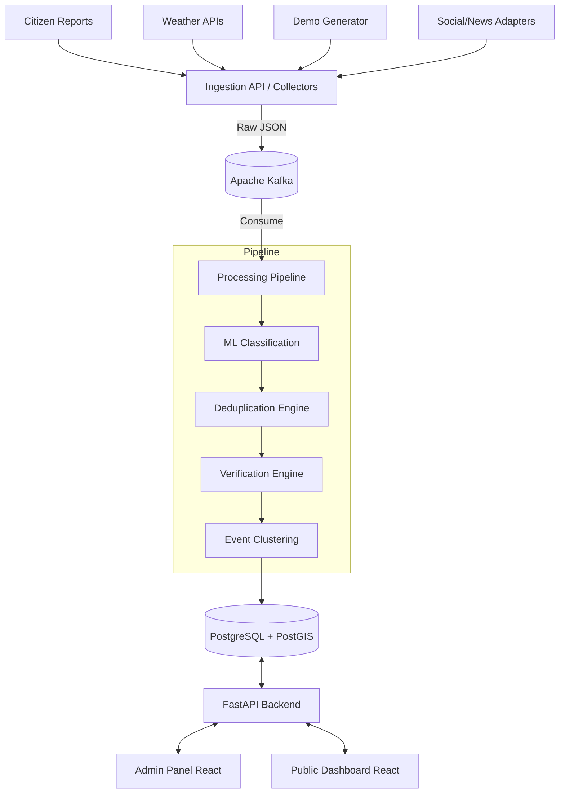

# System Architecture

## 1. High-Level Architecture
The National Weather Big Data Analytics Platform follows a modern decoupled architecture, combining a scalable ingestion pipeline with a robust REST API backend and a responsive frontend dashboard.

## 2. Components
* **Frontend (React, TypeScript, Vite, Tailwind)**: Provides the public dashboard (map, charts, filters) and the admin panel (review queue, management).
* **Backend (FastAPI, Python, SQLAlchemy)**: Handles REST endpoints, authentication, and orchestrates ML and data tasks.
* **Database (PostgreSQL + PostGIS)**: Stores normalized reports, clustered events, user data, and geospatial coordinates for efficient spatial querying.
* **Streaming (Apache Kafka)**: Acts as the buffer for incoming high-volume reports, decoupling ingestion from heavy processing (ML, verification). (To be implemented in Phase 10).
* **ML/AI Engine (Python, Scikit-Learn/Transformers)**: Provides classification and scoring. Runs as a service within or alongside the FastAPI application.

## 3. Technology Stack Justification
* **FastAPI**: Extremely fast, native async support, automatic OpenAPI docs (perfect for academic projects).
* **PostGIS**: Essential for spatial queries (e.g., finding reports within X km of each other for clustering).
* **React + Vite**: Fast development server, modern ecosystem, component reusability.
* **Kafka**: Industry standard for big data streaming, demonstrating enterprise-grade architecture knowledge.
