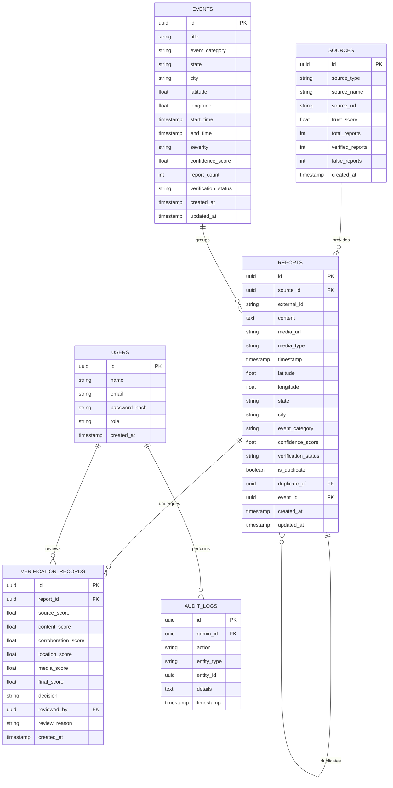

# Database Design

## 1. Relational Schema
The platform uses PostgreSQL with the PostGIS extension for spatial data processing.

## 2. Geospatial Columns
* `latitude` and `longitude` are stored as floats.
* PostGIS `GEOMETRY(Point, 4326)` column will be added to `REPORTS` and `EVENTS` for fast spatial indexing and queries (e.g., `ST_DWithin`).
